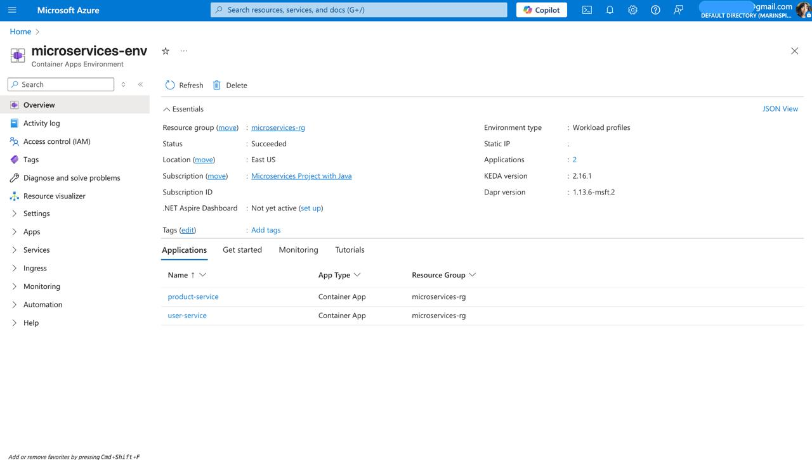

# 🧩 Microservices – Java + Spring Boot + Docker + Azure Container Apps

This project demonstrates a basic microservices architecture using Java 21, Spring Boot, and Maven. The services are containerized with Docker and automatically deployed to Azure Container Apps using GitHub Actions.

## 🛠️ Microservices

- **user-service** – Manages user data
- **product-service** – Manages product catalog

---

## 🖼️ Azure Container Apps Dashboard

> Screenshot of both services running on Azure Container Apps.



**Run logs:**
`az containerapp logs show --n user-service -g microservices-rg --follow`

---

## 🌐 Public Endpoints (For Testing)

### 🔐 `user-service`

| Endpoint                  | Method | Description                  |
|---------------------------|--------|------------------------------|
| `/auth/register`          | POST   | Register a new user          |
| `/auth/login`             | POST   | Login user                   |
| `/swagger-ui/index.html`  | GET    | Swagger UI for user-service  |

➡️ **Try Swagger**:  
`https://user-service.jollybush-8dd5bb72.eastus.azurecontainerapps.io/swagger-ui/index.html`

---

### 📦 `product-service`

| Endpoint                  | Method | Description                    |
|---------------------------|--------|--------------------------------|
| `/products`               | GET    | Get all products               |
| `/products/{id}`          | GET    | Get product by ID              |
| `/swagger-ui/index.html`  | GET    | Swagger UI for product-service |

➡️ **Try Swagger**:  
`https://product-service.jollybush-8dd5bb72.eastus.azurecontainerapps.io/swagger-ui/index.html`

---

## 🚀 Running Locally

### 🔧 Requirements

- Java 21
- Maven (`mvn -v`)
- Docker and Docker Compose

---

### ▶️ Run with Maven

Open two terminals, run each service:

```bash
cd user-service
mvn clean install
mvn spring-boot:run 
```
```bash
cd product-service
mvn clean install
mvn spring-boot:run 
```
